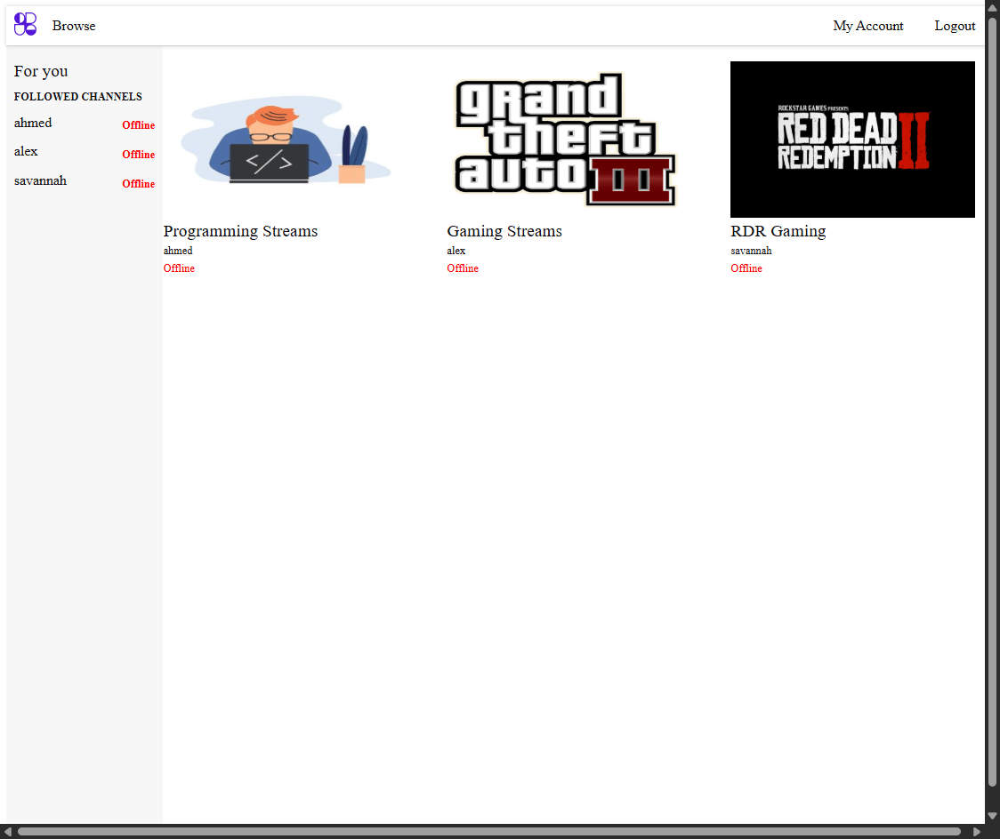
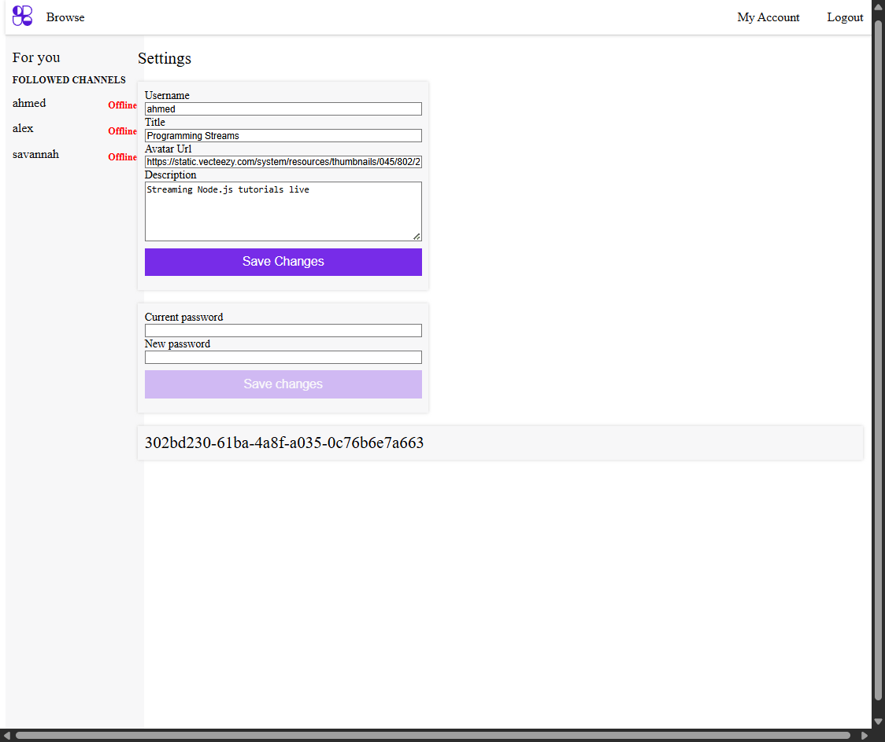
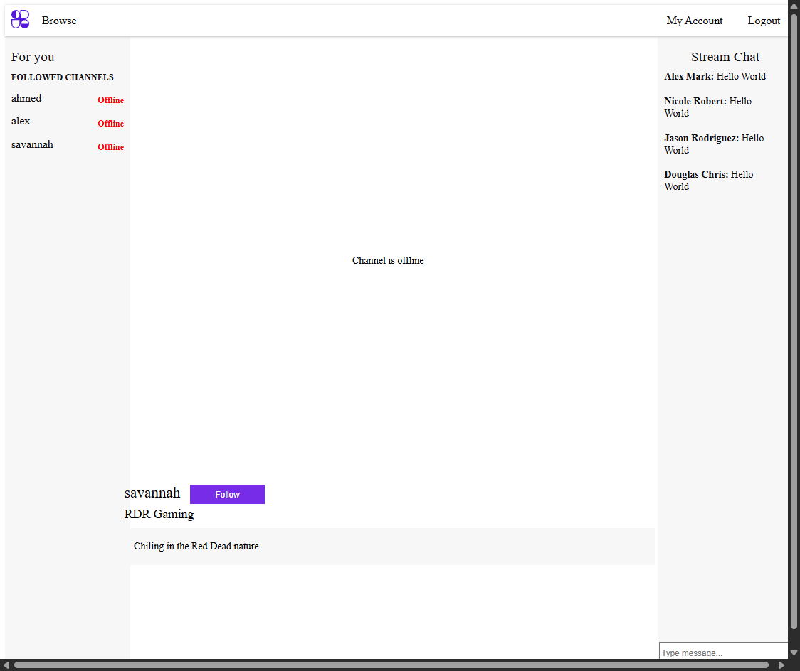
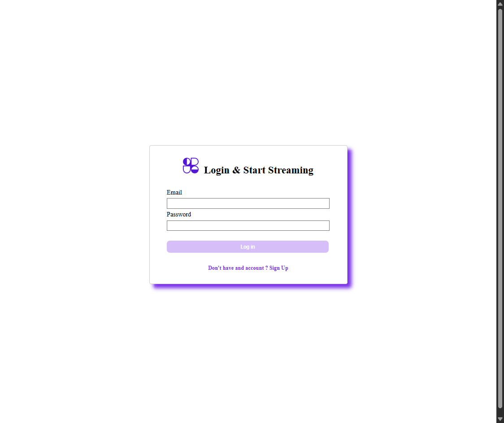
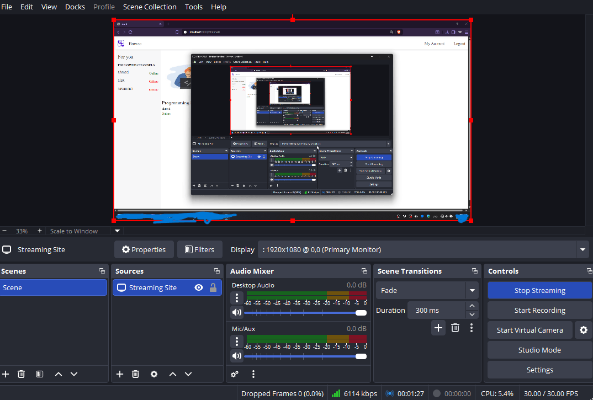

# Full Stack Live Streaming Platform

> A comprehensive, full-stack live streaming MVP demonstrating the complex architecture behind platforms like Twitch.


> [!IMPORTANT]
> This project is currently in active development. Focus areas include finalizing the RTMP integration and socket.io live chat systems.

## 📸 Project Screenshots

|                           Desktop Main Feed                           |                            Streamer Settings                             |                Live Channel (Stream + Chat)                 |
| :-------------------------------------------------------------------: | :----------------------------------------------------------------------: | :---------------------------------------------------------: |
|         |  |  |
|                            **Login Page**                             |                            **Register Page**                             |                   **OBS Streaming Setup**                   |
|                            |                         |                |
|                      **Online Status Indicator**                      |                                                                          |                                                             |
|  |                                                                          |                                                             |

## 🏗️ Architecture

This project utilizes a robust three-tier architecture designed for real-time video streaming and communication:

1.  **Client (React & Vite):** A responsive, high-performance frontend application responsible for UI rendering, video playback, and real-time chat interactions.
2.  **API Server (Node & Express):** The core backend handling RESTful operations, JWT-based user authentication, database interactions (MongoDB), and WebSocket (Socket.io) connections for live chat.
3.  **RTMP Media Server (Node Media Server):** A dedicated live streaming server responsible for receiving the RTMP video ingest from broadcasters and distributing the stream.

## 🗺️ Feature Roadmap

### Completed
- **User Authentication:** Secure registration and login using JWT.
- **Browse Channels:** Dynamic grid displaying all active streaming channels.
- **Channel Viewing:** Watch streams, view channel descriptions, and access user metadata.
- **Follow System:** Users can subscribe/unsubscribe to their favorite channels.
- **User Dashboard:**
  - **Channel Settings:** Update channel title, description, and avatar.
  - **Password Management:** Secure password modification.
  - **Stream Key Management:** View and regenerate unique stream keys.

### 📍 In Progress
- **Real-time Streaming (RTMP):** Integration with `node-media-server` to handle incoming live video feeds seamlessly.
- **Live Chat (Socket.io):** Low-latency, real-time chat rooms tied to individual channel pages.

## 🗄️ Database Schema

The application uses MongoDB as its primary database, managed via Mongoose. The database is structured around three core schemas:

### User (`User.ts`)
Handles authentication and user-specific relationships.
- `username` (String) - Display name of the user.
- `email` (String, unique) - Unique email address for registration.
- `password` (String) - Hashed password for security.
- `channel` (ObjectId, Ref: `Channel`) - Reference to the user's broadcast channel.
- `followedChannels` (Array of ObjectId, Ref: `Channel`) - List of channels the user follows.

### Channel (`Channel.ts`)
Stores streaming metadata, settings, and socket relationships.
- `isActive` (Boolean, default: false) - Live status indicator.
- `title` (String) - Stream title.
- `description` (String) - Channel bio.
- `avatarUrl` (String) - Profile image URL.
- `streamKey` (String, default: UUID) - Unique identifier for RTMP ingested stream.
- `messages` (Array of ObjectId, Ref: `Message`) - Linked chat history.

### Message (`Message.ts`)
Manages real-time chat data persistence.
- `author` (String) - Name of the user sending the message.
- `content` (String) - The text payload.
- `date` (Date) - Timestamp of the message.

## 🔌 API Documentation

The RESTful API is built with Express.js. Protected routes require a JWT bearer token. Request validation is handled via Joi.

### Authentication (`/api/auth`)
- `POST /register` - Create a new user account.
  - Payload: `{ username, email, password }`
- `POST /login` - Authenticate an existing user.
  - Payload: `{ email, password }`

### Channels (`/api/channels`)
- `GET /` - Retrieve a diverse list of broadcasting channels.
- `GET /:channelId` - Retrieve active details and metadata for a specific channel.
- `GET /followed` (Protected) - Retrieve a list of channels followed by the authenticated user.
- `POST /follow` (Protected) - Follow or unfollow a channel.
  - Payload: `{ channelId }`

### Settings (`/api/settings`)
- `GET /channel` (Protected) - Fetch current settings for the authenticated user's channel.
- `PUT /channel` (Protected) - Update the authenticated user's channel metadata.
  - Payload: `{ username, description, title, avatarUrl }`
- `PATCH /password` (Protected) - Update the authenticated user's password.
  - Payload: `{ password, newPassword }`

## ⚙️ Installation

### Prerequisites
- Node.js (v18 or later recommended)
- npm (v8 or later)
- A running MongoDB instance (local or Atlas)

### 1. Root Setup
Clone the repository and install root dependencies (which includes `concurrently` for running dev servers).

```bash
git clone https://github.com/ahmedsalah-tech/Twitch-tv-Clone.git
cd Twitch-tv-Clone
npm install
```

### 2. API Server & Database Setup
Set up the Express backend and connect your database. You can use either a **Local MongoDB Instance** or a **Managed MongoDB Atlas** cluster.
- **Local:** Ensure your local MongoDB server is running. Your connection string will typically be `mongodb://127.0.0.1:27017/twitch-clone`.
- **Atlas:** Create a free cluster, whitelist your IP address, create a database user, and copy the provided `mongodb+srv://...` connection string.

```bash
cd server
cp .env.example .env
# Edit .env with your PORT, MONGO_URI (using one of the strings above), and TOKEN_KEY
npm install
```

### 3. Client Frontend
Set up the React application.

```bash
# From the root directory
cd client
npm install
```

### 4. RTMP Media Server
Set up the streaming server.

```bash
# From the root directory
cd rtmp-server
npm install
```

## 🚀 Running the Application

1. **Start the API Server and Client:**
   From the root directory, run the `dev` script to spin up both the Express API and React frontend concurrently.
   ```bash
   npm run dev
   ```
   - Client: `http://localhost:3000`
   - Server: `http://localhost:5002`

2. **Start the RTMP Media Server:**
   In a separate terminal window, start the RTMP ingest server:
   ```bash
   cd rtmp-server
   npm run dev
   ```
   - RTMP Server listening on port `1935`.

## 📡 Streaming Guide (How to Stream)

To broadcast your live stream to the platform, you will need streaming software like [OBS Studio](https://obsproject.com/).

1. Log in to your account and navigate to your **Streamer Dashboard** (My Account).
2. **Important:** Add an **Avatar URL** in your channel settings and save the changes. Your channel will *only* become visible on the main dashboard to other users if you provide an avatar.
3. From the **My Account** page, locate and copy your unique **Stream Key**.
4. Open **OBS Studio** and navigate to `File` > `Settings` > `Stream`.
5. Select `Custom...` from the Service dropdown.
6. In the **Server** field, enter the RTMP URL: `rtmp://localhost:1935/live`
7. In the **Stream Key** field, paste the key copied from your dashboard.
8. Click **Start Streaming** in OBS!



## 📄 License

This project is licensed under the MIT License.

This project is free and open-source software. You are permitted to use, copy, modify, merge, publish, distribute, sublicense, and/or sell copies of the software, provided that proper credit is given to the original author ([ahmedsalah-tech](https://github.com/ahmedsalah-tech)).
